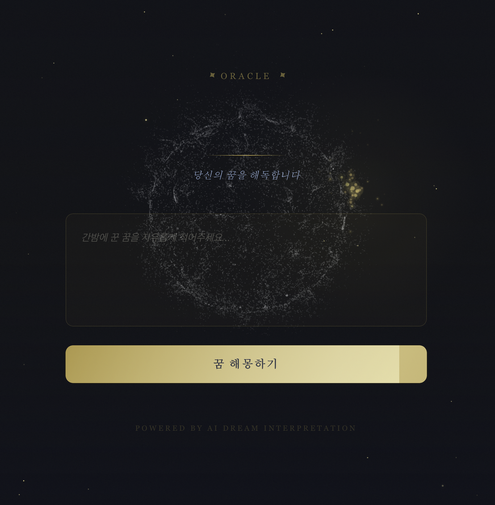
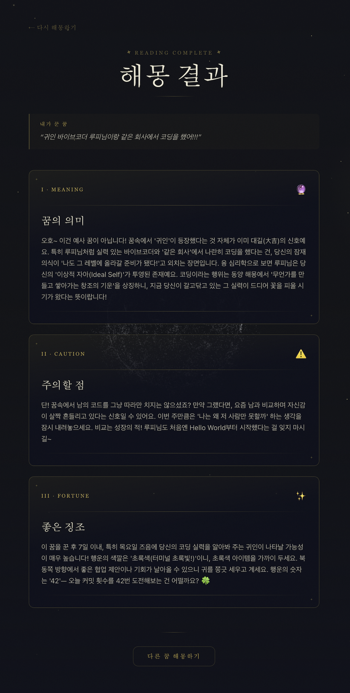

# Dream Hacking - 꿈 해몽 AI (데모)

AI 기반 꿈 해몽 웹 서비스의 데모 버전입니다. 꿈 내용을 입력하면 꿈의 의미, 주의사항, 좋은 징조를 분석해 보여줍니다.

> 이 저장소는 데모/포트폴리오 용도입니다. API 키 없이 바로 실행할 수 있습니다.
> 정식 버전에서는 Claude API를 활용한 실제 AI 해몽 분석을 제공합니다.

## Screenshots

<!-- 스크린샷을 추가해 주세요 -->
| 메인 화면 | 결과 화면 |
|:---------:|:---------:|
|  |  |

## 기술 스택

| 구분 | 기술 |
|------|------|
| 프레임워크 | Next.js 16 (App Router) |
| 언어 | TypeScript |
| UI 라이브러리 | React 19 |
| 스타일링 | Tailwind CSS 4 |
| 3D 비주얼 | Spline (`@splinetool/react-spline`) |
| AI (정식 버전) | Claude API (`@anthropic-ai/sdk`) |

## 주요 기능

- **AI 꿈 해몽** - 꿈 내용을 분석하여 의미 / 주의사항 / 좋은 징조 3가지로 해석
- **3D 배경** - Spline을 활용한 몽환적인 3D 배경 씬
- **인터랙티브 UI** - 스트리밍 응답, 타이핑 애니메이션, 카드 전환 효과
- **커서 이펙트** - 마우스 움직임에 반응하는 시각 효과
- **반응형 디자인** - 모바일/데스크톱 대응

## 데모 동작 원리 (API 키 없이 작동하는 방식)

데모 버전은 외부 AI API 호출 없이, **텍스트 기반 해시 알고리즘**으로 해몽 결과를 생성합니다.

### 1. 키워드 매핑

사용자가 입력한 꿈 텍스트에서 미리 정의된 키워드를 탐지하여 해당 카테고리의 응답을 반환합니다.

| 카테고리 | 키워드 예시 |
|---------|-----------|
| 물/자연 | 물, 바다, 강, 비, 수영, 홍수, 파도 |
| 인물 | 사람, 친구, 가족, 엄마, 아빠, 연인 |
| 하늘/비행 | 하늘, 날다, 비행, 새, 구름, 별, 달 |
| 재물 | 돈, 금, 보석, 복권, 부자, 지갑 |
| 동물 | 개, 고양이, 뱀, 호랑이, 용, 돼지 |
| 장소 | 집, 건물, 학교, 회사, 문, 계단 |

### 2. 해시 기반 폴백

키워드가 매칭되지 않는 경우, 입력 텍스트를 **비트 시프트 해시 함수**(`(hash << 5) - hash + charCode`)로 변환하여 32bit 정수 해시값을 생성한 뒤, 사전 작성된 응답 배열의 인덱스(`hash % 응답 수`)로 매핑합니다. 이를 통해 동일한 꿈 내용에 대해 항상 일관된 결과를 반환합니다.

### 3. 응답 구조

각 응답은 MZ세대 감성의 톤으로 작성된 3가지 필드로 구성됩니다:

```json
{
  "meaning": "꿈의 의미 해석",
  "caution": "주의할 점",
  "fortune": "좋은 징조 (럭키넘버, 행운색, 골든타임 포함)"
}
```

> 정식 버전에서는 이 로직 대신 Claude API를 호출하여 실시간 AI 해몽 분석을 제공합니다.

## 시작하기

```bash
# 의존성 설치
npm install

# 개발 서버 실행
npm run dev
```

[http://localhost:3000](http://localhost:3000)에서 확인할 수 있습니다.

> 데모 버전이므로 별도의 API 키 설정이 필요하지 않습니다.

## 프로젝트 구조

```
app/
├── page.tsx              # 메인 페이지 (3D 배경 + 꿈 입력 폼)
├── result/page.tsx       # 해몽 결과 페이지
├── api/interpret/route.ts # 해몽 API 엔드포인트
└── globals.css           # 글로벌 스타일
components/
├── SplineBackground.tsx  # Spline 3D 배경
├── DreamInput.tsx        # 꿈 입력 폼
└── ResultCard.tsx        # 결과 카드
```

## 정식 버전 안내

정식 버전에서는 Anthropic Claude API를 연동하여 실제 AI 해몽 분석을 제공합니다. `.env.local`에 다음 환경 변수를 설정하면 됩니다:

```env
ANTHROPIC_API_KEY=your-api-key
```

## 링크

- GitHub: [https://github.com/sshgjr/Dream_Hacking_Ex](https://github.com/sshgjr/Dream_Hacking_Ex)
